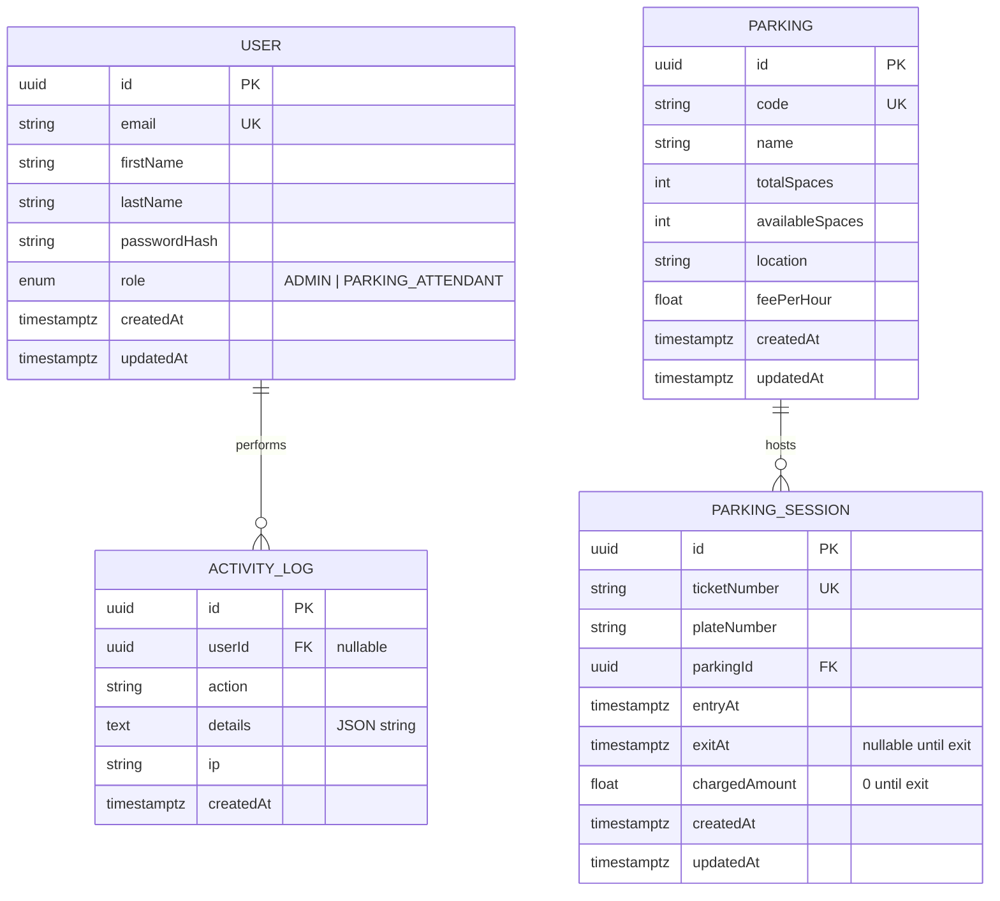

# Database design

This document describes the **logical data model** for the XWZ parking management system. The physical schema is implemented with **Prisma** and **PostgreSQL** (see `backend/prisma/schema.prisma` and `backend/prisma/migrations/`).

---

## 1. Design goals

| Goal | How it is met |
|------|----------------|
| Clear ownership of entities | One table per aggregate: users, parkings, sessions, audit logs. |
| Referential integrity | Foreign keys with `ON DELETE CASCADE` (session → parking) or `SET NULL` (log → user). |
| Reporting performance | Indexes on `entryAt`, `exitAt`, `parkingId`, `plateNumber`, and log timestamps. |
| Safe billing | `exitAt` and `chargedAmount` updated only on checkout; defaults match business rules. |

---

## 2. Entity–relationship diagram

The diagram below matches the Prisma models. GitHub renders Mermaid in Markdown previews.

**Relationship rules (plain language)**

- A **User** may have many **ActivityLog** rows (login, registration, operational actions). If the user is removed later, logs keep `userId` as null (`SET NULL`).
- A **Parking** lot has many **ParkingSession** rows over time. Deleting a parking lot would remove its sessions (`CASCADE`); in production you may prefer soft-delete instead.

---

## 3. Table reference

### 3.1 `User`

Stores operators who sign in to the web app. Passwords are never stored in plain text.

| Column | Type (Postgres) | Constraints | Description |
|--------|-----------------|---------------|---------------|
| `id` | `TEXT` (UUID) | PK | Stable identifier for JWT `sub`. |
| `email` | `TEXT` | UNIQUE, NOT NULL | Login; stored lowercased by application logic. |
| `firstName`, `lastName` | `TEXT` | NOT NULL | Display and audit. |
| `passwordHash` | `TEXT` | NOT NULL | bcrypt hash. |
| `role` | `Role` enum | NOT NULL, default `PARKING_ATTENDANT` | `ADMIN` or `PARKING_ATTENDANT`. |
| `createdAt`, `updatedAt` | `TIMESTAMP(3)` | NOT NULL | Audit timestamps. |

### 3.2 `Parking`

Represents a parking area (street or private lot) identified by a short **code** (e.g. `KG-01`).

| Column | Type | Constraints | Description |
|--------|------|-------------|-------------|
| `id` | UUID | PK | Internal id for APIs. |
| `code` | `TEXT` | UNIQUE, NOT NULL | Human-facing identifier; used at entry time. |
| `name` | `TEXT` | NOT NULL | Friendly name. |
| `totalSpaces` | `INTEGER` | NOT NULL | Capacity. |
| `availableSpaces` | `INTEGER` | NOT NULL | Decremented on entry, incremented on exit (capped at `totalSpaces`). |
| `location` | `TEXT` | NOT NULL | Address or description. |
| `feePerHour` | `DOUBLE PRECISION` | NOT NULL | Rate used for billing (partial hours rounded up in app logic). |
| `createdAt`, `updatedAt` | `TIMESTAMP(3)` | NOT NULL | Audit. |

### 3.3 `ParkingSession`

One row per vehicle visit: from **entry** (ticket issued) until **exit** (bill finalized).

| Column | Type | Constraints | Description |
|--------|------|-------------|-------------|
| `id` | UUID | PK | Session id used for exit API. |
| `ticketNumber` | `TEXT` | UNIQUE, NOT NULL | Printed / shown to driver at entry. |
| `plateNumber` | `TEXT` | NOT NULL | Normalised to uppercase in API. |
| `parkingId` | UUID | FK → `Parking.id`, ON DELETE CASCADE | Which lot. |
| `entryAt` | `TIMESTAMP(3)` | NOT NULL | When the vehicle entered. |
| `exitAt` | `TIMESTAMP(3)` | NULL until exit | NULL means vehicle still inside. |
| `chargedAmount` | `DOUBLE PRECISION` | NOT NULL, default `0` | Set together with `exitAt` on checkout. |
| `createdAt`, `updatedAt` | `TIMESTAMP(3)` | NOT NULL | Audit. |

**Indexes:** `parkingId`, `entryAt`, `exitAt`, `plateNumber` (see migration SQL).

### 3.4 `ActivityLog`

Append-only style audit trail for security and compliance.

| Column | Type | Constraints | Description |
|--------|------|-------------|-------------|
| `id` | UUID | PK | |
| `userId` | UUID | FK → `User.id`, NULL OK, ON DELETE SET NULL | Who triggered the action, if known. |
| `action` | `TEXT` | NOT NULL | Short code, e.g. `USER_LOGIN`, `CAR_ENTRY`. |
| `details` | `TEXT` | NULL | Optional JSON payload as string. |
| `ip` | `TEXT` | NULL | Client IP when available. |
| `createdAt` | `TIMESTAMP(3)` | NOT NULL, default now | When the event was recorded. |

**Indexes:** `createdAt`, `action`.

### 3.5 Enum `Role`

| Value | Meaning |
|-------|---------|
| `ADMIN` | Full parking administration; activity log API. |
| `PARKING_ATTENDANT` | Day-to-day entry/exit and reporting; default for self-registration. |

---

## 4. Typical write sequences

**Entry (successful)**

1. Read `Parking` by `code`; ensure `availableSpaces > 0`.
2. Insert `ParkingSession` with `exitAt = null`, `chargedAmount = 0`, new `ticketNumber`.
3. Decrement `Parking.availableSpaces` by 1 (transactional).

**Exit (successful)**

1. Load `ParkingSession` with `Parking` for rate; ensure `exitAt` is still null.
2. Compute charge from `entryAt`, exit time, and `feePerHour`.
3. Update session `exitAt`, `chargedAmount`; increment `availableSpaces` (cap at `totalSpaces`).

---

## 5. Where to look in code

| Artifact | Path |
|----------|------|
| Prisma schema | `backend/prisma/schema.prisma` |
| SQL migration | `backend/prisma/migrations/*/migration.sql` |
| Seed (admin user) | `backend/prisma/seed.ts` |

For the **overall system** (not only the database), see [SYSTEM_ARCHITECTURE.md](./SYSTEM_ARCHITECTURE.md).
