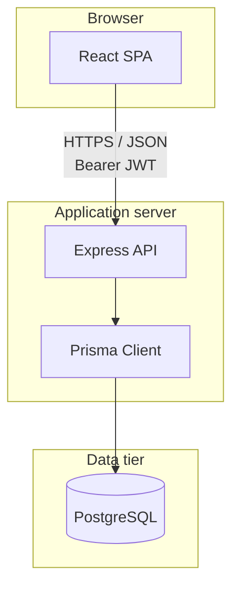
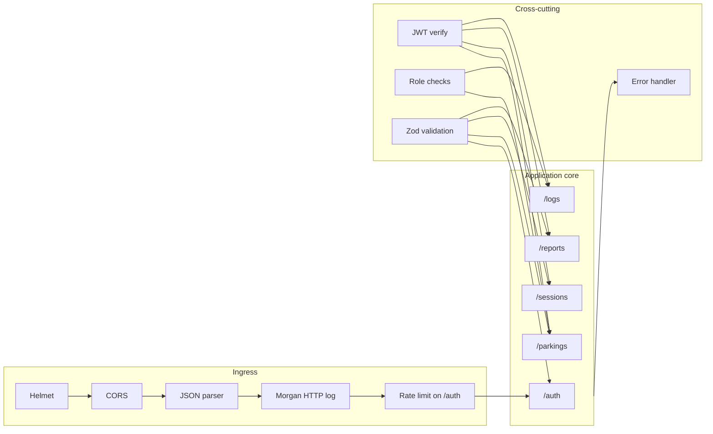
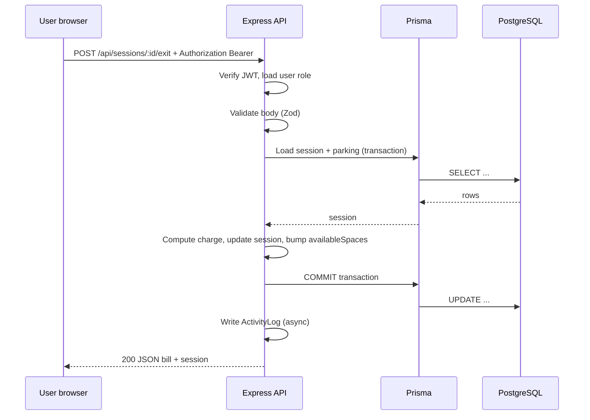
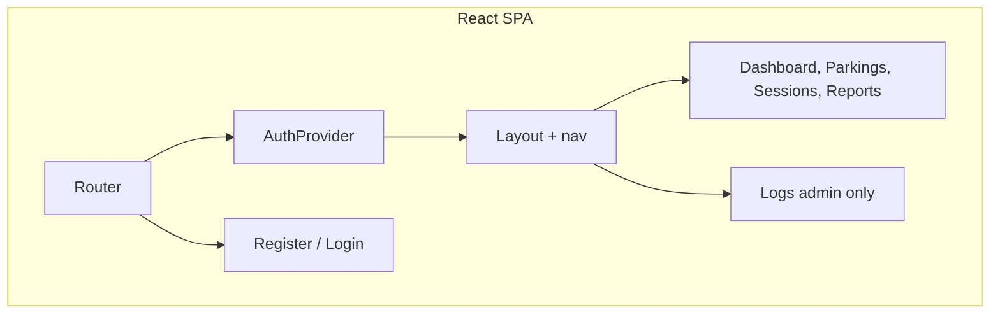
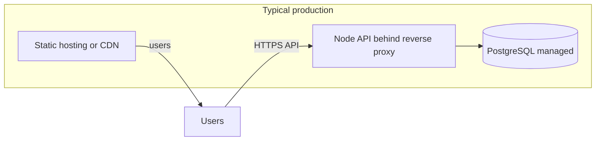

# System architecture

This document explains **how the XWZ parking system is structured**: major components, how requests flow, and how security is applied. It complements [SOFTWARE_REQUIREMENTS.md](./SOFTWARE_REQUIREMENTS.md) (what the system must do) and [DATABASE_DESIGN.md](./DATABASE_DESIGN.md) (how data is stored).

---

## 1. High-level overview

The system is a **single-repository full-stack application**:

| Layer | Technology | Responsibility |
|-------|------------|----------------|
| **Client** | React (Vite, TypeScript) | Signup/login, parking admin forms, session entry/exit, reports, activity logs (admin). |
| **API** | Node.js, Express, TypeScript | REST endpoints, JWT validation, business rules, Prisma ORM. |
| **Database** | PostgreSQL | Persistent storage for users, parkings, sessions, and audit logs. |

**Development note:** the Vite dev server can **proxy** `/api` to the Express port so the browser treats API calls as same-origin and avoids CORS friction during local work (`frontend/vite.config.ts`).

---

## 2. Logical architecture (backend)

The API is organised as **routers** mounted under `/api`. Cross-cutting behaviour lives in **middleware**.

| Route group | Authentication | Authorization highlights |
|-------------|----------------|---------------------------|
| `/api/auth/register`, `/login` | Public (rate limited) | Registration always creates `PARKING_ATTENDANT`. |
| `/api/auth/me` | JWT required | — |
| `/api/parkings` GET | JWT | Any authenticated user. |
| `/api/parkings` POST/PUT/DELETE | JWT | **Admin** only. |
| `/api/sessions/*` | JWT | Admin and attendant. |
| `/api/reports/*` | JWT | Admin and attendant. |
| `/api/logs` | JWT | **Admin** only. |

---

## 3. Request lifecycle (example: car exit)

---

## 4. Frontend architecture

| Area | Implementation |
|------|------------------|
| **Routing** | `react-router-dom`: public routes (`/login`, `/register`), protected shell with sidebar (`Layout`), nested routes for dashboard pages. |
| **Auth state** | `AuthContext`: stores JWT in `localStorage`, attaches `Authorization` header via `apiFetch`. |
| **API access** | Central `apiFetch` helper: normalises errors, supports pagination responses. |
| **UI** | Component-level pages under `frontend/src/pages/`; shared `PaginationBar`, global styles in `styles.css`. |

---

## 5. Security architecture

| Concern | Mitigation |
|---------|------------|
| **Transport** | Use HTTPS in production; never send JWT in query strings. |
| **Authentication** | Short-lived configurable JWT (`JWT_SECRET`, `JWT_EXPIRES_IN`); bcrypt for passwords. |
| **Authorization** | Role checks on mutating parking routes and log listing. |
| **Abuse** | Rate limiting on `/api/auth`; JSON body size limit; Helmet security headers. |
| **CORS** | Allow-list origin from `FRONTEND_URL`. |
| **Audit** | `ActivityLog` table + HTTP access logs (morgan). |

---

## 6. API documentation

Interactive documentation is served by the backend:

- **Swagger UI:** `{API_BASE}/api/docs` (e.g. `http://localhost:4000/api/docs` when running locally).
- **OpenAPI source:** `backend/openapi.yaml`.

---

## 7. Deployment view (conceptual)

For coursework or small deployments, one VM or PaaS instance can host both processes; production often splits them.

Environment variables (see `backend/.env.example`) configure database URL, JWT, CORS origin, and port.

---

## 8. Related documents

| Document | Purpose |
|----------|---------|
| [SOFTWARE_REQUIREMENTS.md](./SOFTWARE_REQUIREMENTS.md) | Requirements, forms list, brief data-flow snippet. |
| [DATABASE_DESIGN.md](./DATABASE_DESIGN.md) | Tables, ER diagram, indexes, write sequences. |
| [../README.md](../README.md) | Clone, migrate, seed, run frontend and backend. |
